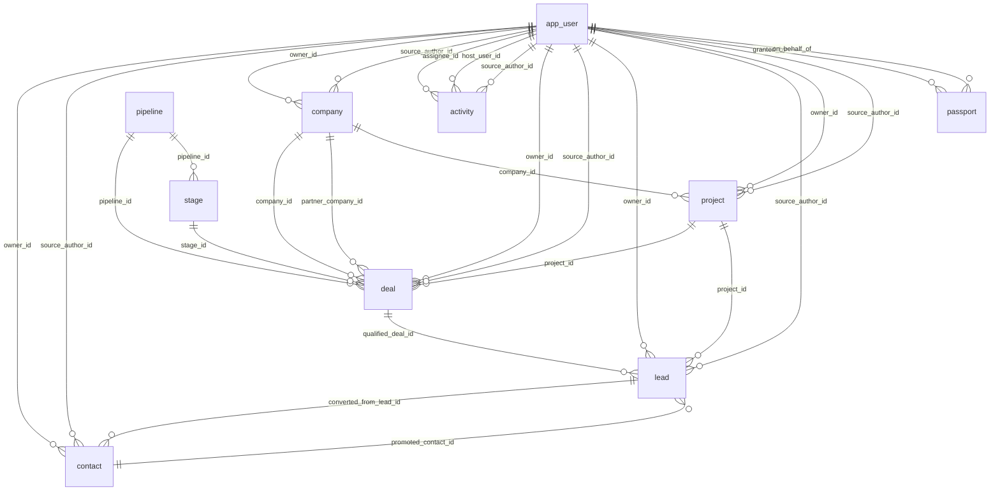

# Entity model

<!-- Generated by backend/gates/entitymodel_test.go. Do not edit by hand. -->

Every table this product keeps, what each column is, and how the records point
at each other.

**This page set is generated and an edit made here is lost.** It is rendered
from the schema the migrations build (`backend/migrations/testdata/head_catalog.txt`),
the field descriptions in the API contract (`backend/api/crm.yaml`), and the
module that owns each table's writes. Nothing a reader has to keep in step by
hand is on it.

Changing the model means changing one of those three, and the gate that renders
this fails on the same run — so regenerate it with the change that moved it:

    cd backend && go test ./gates -run EntityModel -update-entity-model

A column that reads only `Required text` or `Optional text` has no description
anywhere in the tree — the catalog knows its type and nothing has said what it
is for. Give it one by adding a `description:` to the matching field in
`backend/api/crm.yaml`, and the next regeneration picks it up.

For WHY the schema is shaped this way rather than what it holds, read
[explanation/architecture.md](../../explanation/architecture.md) and
[explanation/write-backbone.md](../../explanation/write-backbone.md). For which
module to put a change in, read [modules.md](../modules.md).

## The shape

| | |
|---|--:|
| Tables | 293 |
| Columns | 3484 |
| Foreign keys | 472 |
| Owning areas | 36 |

## The 12 records everything else hangs off

Ranked by how many foreign keys point at them, so this list follows the schema rather than anybody's idea of what matters.

| Record | Lives in | Columns | Foreign keys pointing at it |
|---|---|--:|--:|
| [`app_user`](identity.md#app_user) | [identity](identity.md) | 22 | 126 |
| [`contact`](contacts.md#contact) | [contacts](contacts.md) | 32 | 41 |
| [`company`](contacts.md#company) | [contacts](contacts.md) | 43 | 40 |
| [`activity`](activities.md#activity) | [activities](activities.md) | 58 | 32 |
| [`deal`](deals.md#deal) | [deals](deals.md) | 43 | 22 |
| [`lead`](contacts.md#lead) | [contacts](contacts.md) | 36 | 13 |
| [`stage`](deals.md#stage) | [deals](deals.md) | 10 | 10 |
| [`project`](projects.md#project) | [projects](projects.md) | 23 | 9 |
| [`passport`](identity.md#passport) | [identity](identity.md) | 11 | 8 |
| [`consent_purpose`](consent.md#consent_purpose) | [consent](consent.md) | 7 | 7 |
| [`pipeline`](deals.md#pipeline) | [deals](deals.md) | 8 | 7 |
| [`team`](identity.md#team) | [identity](identity.md) | 6 | 7 |

## The pages

| Area | Tables |
|---|--:|
| [activities](activities.md) | 25 |
| [agents](agents.md) | 3 |
| [ai](ai.md) | 12 |
| [aiactivity](aiactivity.md) | 1 |
| [approvals](approvals.md) | 3 |
| [assignments](assignments.md) | 2 |
| [assurance](assurance.md) | 7 |
| [automation](automation.md) | 3 |
| [capture](capture.md) | 22 |
| [collections](collections.md) | 10 |
| [commissions](commissions.md) | 1 |
| [comms](comms.md) | 1 |
| [compose](compose.md) | 36 |
| [consent](consent.md) | 17 |
| [contacts](contacts.md) | 39 |
| [continuity](continuity.md) | 1 |
| [contracts](contracts.md) | 1 |
| [customfields](customfields.md) | 1 |
| [dealrooms](dealrooms.md) | 8 |
| [deals](deals.md) | 22 |
| [finance](finance.md) | 5 |
| [forecasting](forecasting.md) | 4 |
| [identity](identity.md) | 22 |
| [integrations](integrations.md) | 4 |
| [introductions](introductions.md) | 1 |
| [knowledge](knowledge.md) | 3 |
| [migration](migration.md) | 2 |
| [notices](notices.md) | 3 |
| [platform](platform.md) | 9 |
| [privacy](privacy.md) | 2 |
| [projects](projects.md) | 3 |
| [reporting](reporting.md) | 10 |
| [search](search.md) | 4 |
| [signals](signals.md) | 2 |
| [webhooks](webhooks.md) | 2 |
| [weeklyplan](weeklyplan.md) | 2 |

## Every table

| Table | Area | Columns | Referenced by |
|---|---|--:|--:|
| [`activity`](activities.md#activity) | activities | 58 | 32 |
| [`activity_audience_member`](activities.md#activity_audience_member) | activities | 5 | 0 |
| [`activity_identity`](activities.md#activity_identity) | activities | 5 | 0 |
| [`activity_kind`](compose.md#activity_kind) | compose | 1 | 1 |
| [`activity_link`](activities.md#activity_link) | activities | 9 | 0 |
| [`activity_mail_reference`](activities.md#activity_mail_reference) | activities | 3 | 0 |
| [`activity_meeting_attendee_repair`](compose.md#activity_meeting_attendee_repair) | compose | 3 | 0 |
| [`activity_meeting_history`](activities.md#activity_meeting_history) | activities | 12 | 0 |
| [`activity_meeting_rsvp_backfill`](compose.md#activity_meeting_rsvp_backfill) | compose | 3 | 0 |
| [`activity_participant`](activities.md#activity_participant) | activities | 9 | 0 |
| [`activity_participant_replay`](compose.md#activity_participant_replay) | compose | 3 | 0 |
| [`activity_reader_state`](activities.md#activity_reader_state) | activities | 8 | 0 |
| [`activity_reply_verdict_history`](activities.md#activity_reply_verdict_history) | activities | 6 | 0 |
| [`activity_request_settlement`](activities.md#activity_request_settlement) | activities | 8 | 0 |
| [`activity_retention_evidence`](activities.md#activity_retention_evidence) | activities | 12 | 0 |
| [`activity_review_response`](activities.md#activity_review_response) | activities | 16 | 0 |
| [`activity_review_template`](activities.md#activity_review_template) | activities | 13 | 0 |
| [`activity_sales_state`](activities.md#activity_sales_state) | activities | 5 | 0 |
| [`agent_run`](agents.md#agent_run) | agents | 17 | 1 |
| [`agent_standing_grant`](agents.md#agent_standing_grant) | agents | 8 | 0 |
| [`agent_task`](compose.md#agent_task) | compose | 13 | 0 |
| [`ai_call`](ai.md#ai_call) | ai | 40 | 1 |
| [`ai_call_config`](ai.md#ai_call_config) | ai | 6 | 1 |
| [`ai_call_payload`](ai.md#ai_call_payload) | ai | 5 | 0 |
| [`ai_feedback`](ai.md#ai_feedback) | ai | 15 | 0 |
| [`ai_model_rate`](ai.md#ai_model_rate) | ai | 11 | 0 |
| [`ai_task_run`](aiactivity.md#ai_task_run) | aiactivity | 25 | 0 |
| [`ai_usage`](ai.md#ai_usage) | ai | 10 | 0 |
| [`analytics_share`](compose.md#analytics_share) | compose | 14 | 0 |
| [`app_user`](identity.md#app_user) | identity | 22 | 126 |
| [`approval`](approvals.md#approval) | approvals | 30 | 3 |
| [`approval_autonomy_policy`](approvals.md#approval_autonomy_policy) | approvals | 12 | 0 |
| [`assurance_cycle`](assurance.md#assurance_cycle) | assurance | 6 | 1 |
| [`assurance_exception`](assurance.md#assurance_exception) | assurance | 20 | 3 |
| [`assurance_resolution`](assurance.md#assurance_resolution) | assurance | 12 | 0 |
| [`assurance_run`](assurance.md#assurance_run) | assurance | 13 | 2 |
| [`assurance_run_finding`](assurance.md#assurance_run_finding) | assurance | 4 | 0 |
| [`assurance_source_coverage`](assurance.md#assurance_source_coverage) | assurance | 9 | 0 |
| [`assurance_task_item`](assurance.md#assurance_task_item) | assurance | 8 | 0 |
| [`attachment`](activities.md#attachment) | activities | 26 | 6 |
| [`attachment_extraction`](activities.md#attachment_extraction) | activities | 12 | 0 |
| [`audit_log`](platform.md#audit_log) | platform | 14 | 2 |
| [`auth_token`](identity.md#auth_token) | identity | 7 | 0 |
| [`automation`](automation.md#automation) | automation | 15 | 0 |
| [`automation_effect_claim`](automation.md#automation_effect_claim) | automation | 6 | 0 |
| [`booking_page`](activities.md#booking_page) | activities | 6 | 0 |
| [`brief_item`](compose.md#brief_item) | compose | 15 | 0 |
| [`brief_run`](compose.md#brief_run) | compose | 13 | 1 |
| [`bulk_confirmation`](compose.md#bulk_confirmation) | compose | 7 | 0 |
| [`bulk_operation`](compose.md#bulk_operation) | compose | 13 | 0 |
| [`capture_alias_sighting`](capture.md#capture_alias_sighting) | capture | 5 | 0 |
| [`capture_auto_enrich_budget`](capture.md#capture_auto_enrich_budget) | capture | 2 | 0 |
| [`capture_auto_enrich_state`](capture.md#capture_auto_enrich_state) | capture | 7 | 0 |
| [`capture_backfill`](capture.md#capture_backfill) | capture | 25 | 1 |
| [`capture_backfill_creation`](capture.md#capture_backfill_creation) | capture | 4 | 0 |
| [`capture_connection`](capture.md#capture_connection) | capture | 20 | 2 |
| [`capture_counterparty_hold`](capture.md#capture_counterparty_hold) | capture | 6 | 0 |
| [`capture_digest`](capture.md#capture_digest) | capture | 5 | 0 |
| [`capture_exclusion`](capture.md#capture_exclusion) | capture | 7 | 0 |
| [`capture_freemail_domain`](capture.md#capture_freemail_domain) | capture | 5 | 0 |
| [`capture_import`](capture.md#capture_import) | capture | 9 | 0 |
| [`capture_owner_identity`](capture.md#capture_owner_identity) | capture | 7 | 0 |
| [`capture_pending_counterparty`](capture.md#capture_pending_counterparty) | capture | 21 | 0 |
| [`capture_sender_override`](capture.md#capture_sender_override) | capture | 7 | 0 |
| [`capture_sweep_run`](capture.md#capture_sweep_run) | capture | 8 | 0 |
| [`capture_sync_state`](capture.md#capture_sync_state) | capture | 10 | 0 |
| [`capture_test_mailbox_sent`](capture.md#capture_test_mailbox_sent) | capture | 8 | 0 |
| [`capture_thread_verdict`](capture.md#capture_thread_verdict) | capture | 16 | 0 |
| [`capture_trace`](capture.md#capture_trace) | capture | 12 | 0 |
| [`channel_connection`](capture.md#channel_connection) | capture | 12 | 0 |
| [`channel_provider`](compose.md#channel_provider) | compose | 5 | 2 |
| [`close_date_run`](deals.md#close_date_run) | deals | 15 | 2 |
| [`close_date_run_member`](deals.md#close_date_run_member) | deals | 5 | 0 |
| [`commission_entry`](commissions.md#commission_entry) | commissions | 18 | 1 |
| [`comms_outbound`](comms.md#comms_outbound) | comms | 40 | 3 |
| [`communication_basis`](consent.md#communication_basis) | consent | 12 | 0 |
| [`communication_decision`](consent.md#communication_decision) | consent | 24 | 0 |
| [`communication_instruction`](consent.md#communication_instruction) | consent | 17 | 2 |
| [`communication_review`](consent.md#communication_review) | consent | 11 | 2 |
| [`communication_suppression`](consent.md#communication_suppression) | consent | 12 | 1 |
| [`company`](contacts.md#company) | contacts | 43 | 40 |
| [`company_brief`](compose.md#company_brief) | compose | 7 | 0 |
| [`company_domain`](contacts.md#company_domain) | contacts | 10 | 0 |
| [`company_domain_disposition`](contacts.md#company_domain_disposition) | contacts | 19 | 0 |
| [`company_dossier`](compose.md#company_dossier) | compose | 6 | 0 |
| [`company_fact`](contacts.md#company_fact) | contacts | 18 | 0 |
| [`company_geocode_state`](contacts.md#company_geocode_state) | contacts | 5 | 0 |
| [`company_growth_fit`](compose.md#company_growth_fit) | compose | 6 | 0 |
| [`company_profile_field`](contacts.md#company_profile_field) | contacts | 15 | 0 |
| [`company_relationship_type`](contacts.md#company_relationship_type) | contacts | 9 | 0 |
| [`company_scan`](compose.md#company_scan) | compose | 16 | 0 |
| [`company_technical_state`](contacts.md#company_technical_state) | contacts | 7 | 0 |
| [`company_vat_check`](contacts.md#company_vat_check) | contacts | 11 | 0 |
| [`confirm_token`](consent.md#confirm_token) | consent | 15 | 2 |
| [`consent_doi_token`](consent.md#consent_doi_token) | consent | 7 | 0 |
| [`consent_event`](consent.md#consent_event) | consent | 16 | 0 |
| [`consent_purpose`](consent.md#consent_purpose) | consent | 7 | 7 |
| [`consent_qualifying_event`](consent.md#consent_qualifying_event) | consent | 10 | 0 |
| [`consent_text_version`](consent.md#consent_text_version) | consent | 14 | 1 |
| [`contact`](contacts.md#contact) | contacts | 32 | 41 |
| [`contact_acquisition_evidence`](contacts.md#contact_acquisition_evidence) | contacts | 10 | 1 |
| [`contact_brief`](compose.md#contact_brief) | compose | 6 | 0 |
| [`contact_channel_identity`](contacts.md#contact_channel_identity) | contacts | 14 | 0 |
| [`contact_confirm_submission`](consent.md#contact_confirm_submission) | consent | 11 | 0 |
| [`contact_consent`](consent.md#contact_consent) | consent | 9 | 0 |
| [`contact_email`](contacts.md#contact_email) | contacts | 13 | 1 |
| [`contact_moment_dismissal`](compose.md#contact_moment_dismissal) | compose | 5 | 0 |
| [`contact_phone`](contacts.md#contact_phone) | contacts | 14 | 1 |
| [`contact_profile_field`](contacts.md#contact_profile_field) | contacts | 17 | 0 |
| [`contact_provider_claim`](contacts.md#contact_provider_claim) | contacts | 16 | 1 |
| [`contact_signature_enrich_state`](contacts.md#contact_signature_enrich_state) | contacts | 4 | 0 |
| [`contact_social`](contacts.md#contact_social) | contacts | 5 | 0 |
| [`contract`](contracts.md#contract) | contracts | 29 | 2 |
| [`conversation_claim`](contacts.md#conversation_claim) | contacts | 19 | 0 |
| [`currency_minor_digits`](platform.md#currency_minor_digits) | platform | 2 | 0 |
| [`custom_field`](customfields.md#custom_field) | customfields | 14 | 0 |
| [`data_subject_request`](consent.md#data_subject_request) | consent | 14 | 0 |
| [`deal`](deals.md#deal) | deals | 43 | 22 |
| [`deal_acquisition_source`](deals.md#deal_acquisition_source) | deals | 9 | 1 |
| [`deal_correction`](deals.md#deal_correction) | deals | 18 | 0 |
| [`deal_document_hide`](activities.md#deal_document_hide) | activities | 4 | 0 |
| [`deal_forecast_history`](deals.md#deal_forecast_history) | deals | 7 | 0 |
| [`deal_risk_day`](deals.md#deal_risk_day) | deals | 7 | 1 |
| [`deal_risk_verdict`](deals.md#deal_risk_verdict) | deals | 2 | 0 |
| [`deal_room`](dealrooms.md#deal_room) | dealrooms | 14 | 6 |
| [`deal_room_comment`](dealrooms.md#deal_room_comment) | dealrooms | 9 | 0 |
| [`deal_room_document`](dealrooms.md#deal_room_document) | dealrooms | 12 | 2 |
| [`deal_room_engagement`](dealrooms.md#deal_room_engagement) | dealrooms | 6 | 0 |
| [`deal_room_invitation`](dealrooms.md#deal_room_invitation) | dealrooms | 14 | 0 |
| [`deal_room_participant`](dealrooms.md#deal_room_participant) | dealrooms | 13 | 5 |
| [`deal_room_session`](dealrooms.md#deal_room_session) | dealrooms | 10 | 0 |
| [`deal_room_thread`](dealrooms.md#deal_room_thread) | dealrooms | 15 | 1 |
| [`deal_stage_evidence`](deals.md#deal_stage_evidence) | deals | 19 | 1 |
| [`deal_stage_history`](deals.md#deal_stage_history) | deals | 19 | 2 |
| [`deal_status_card`](compose.md#deal_status_card) | compose | 6 | 0 |
| [`deal_suggestion`](deals.md#deal_suggestion) | deals | 21 | 1 |
| [`deal_suggestion_evidence`](deals.md#deal_suggestion_evidence) | deals | 7 | 0 |
| [`dedupe_candidate`](contacts.md#dedupe_candidate) | contacts | 19 | 0 |
| [`email_signature`](contacts.md#email_signature) | contacts | 7 | 0 |
| [`embed_store_binding`](search.md#embed_store_binding) | search | 6 | 0 |
| [`embedding`](search.md#embedding) | search | 7 | 0 |
| [`erasure_suppression`](privacy.md#erasure_suppression) | privacy | 3 | 0 |
| [`event_outbox`](platform.md#event_outbox) | platform | 6 | 0 |
| [`extension_ingest_refusal`](compose.md#extension_ingest_refusal) | compose | 6 | 0 |
| [`extension_secret`](platform.md#extension_secret) | platform | 7 | 0 |
| [`federated_identity`](identity.md#federated_identity) | identity | 6 | 0 |
| [`field_mask`](identity.md#field_mask) | identity | 6 | 0 |
| [`field_provenance`](platform.md#field_provenance) | platform | 9 | 0 |
| [`finance_connection`](finance.md#finance_connection) | finance | 15 | 4 |
| [`finance_customer_link`](finance.md#finance_customer_link) | finance | 12 | 0 |
| [`finance_external_customer`](finance.md#finance_external_customer) | finance | 12 | 0 |
| [`finance_invoice`](finance.md#finance_invoice) | finance | 29 | 2 |
| [`finance_payment`](finance.md#finance_payment) | finance | 16 | 0 |
| [`forecast_call`](forecasting.md#forecast_call) | forecasting | 14 | 2 |
| [`forecast_capture_status`](forecasting.md#forecast_capture_status) | forecasting | 6 | 0 |
| [`forecast_contribution`](forecasting.md#forecast_contribution) | forecasting | 26 | 0 |
| [`forecast_snapshot`](forecasting.md#forecast_snapshot) | forecasting | 26 | 2 |
| [`fx_rate`](deals.md#fx_rate) | deals | 6 | 0 |
| [`geocode_cache`](contacts.md#geocode_cache) | contacts | 5 | 0 |
| [`graph_contact_edge`](search.md#graph_contact_edge) | search | 6 | 0 |
| [`graph_interaction_edge`](search.md#graph_interaction_edge) | search | 10 | 0 |
| [`idempotency_key`](compose.md#idempotency_key) | compose | 10 | 0 |
| [`import_record_map`](migration.md#import_record_map) | migration | 6 | 0 |
| [`import_run`](migration.md#import_run) | migration | 13 | 1 |
| [`intro_request`](introductions.md#intro_request) | introductions | 29 | 0 |
| [`knowledge_chunk`](knowledge.md#knowledge_chunk) | knowledge | 11 | 0 |
| [`knowledge_corpus`](knowledge.md#knowledge_corpus) | knowledge | 12 | 1 |
| [`knowledge_document`](knowledge.md#knowledge_document) | knowledge | 16 | 1 |
| [`lead`](contacts.md#lead) | contacts | 36 | 13 |
| [`lead_disqualify_reason`](contacts.md#lead_disqualify_reason) | contacts | 8 | 1 |
| [`lead_manual_signal`](contacts.md#lead_manual_signal) | contacts | 12 | 0 |
| [`lead_score_history`](contacts.md#lead_score_history) | contacts | 9 | 0 |
| [`lead_source`](contacts.md#lead_source) | contacts | 10 | 0 |
| [`linkedin_account`](contacts.md#linkedin_account) | contacts | 5 | 0 |
| [`linkedin_connection`](contacts.md#linkedin_connection) | contacts | 19 | 0 |
| [`list`](collections.md#list) | collections | 14 | 6 |
| [`list_evaluation`](collections.md#list_evaluation) | collections | 6 | 0 |
| [`list_live_member`](collections.md#list_live_member) | collections | 5 | 0 |
| [`list_member`](collections.md#list_member) | collections | 7 | 0 |
| [`list_member_event`](collections.md#list_member_event) | collections | 10 | 0 |
| [`list_revision`](collections.md#list_revision) | collections | 11 | 0 |
| [`list_visit`](collections.md#list_visit) | collections | 4 | 0 |
| [`mail_draft`](activities.md#mail_draft) | activities | 13 | 0 |
| [`maskable_field`](identity.md#maskable_field) | identity | 2 | 1 |
| [`meeting_invitation`](activities.md#meeting_invitation) | activities | 19 | 1 |
| [`meeting_proposal`](activities.md#meeting_proposal) | activities | 9 | 0 |
| [`mfa_challenge_spent`](identity.md#mfa_challenge_spent) | identity | 2 | 0 |
| [`mfa_recovery_code`](identity.md#mfa_recovery_code) | identity | 5 | 0 |
| [`notice`](notices.md#notice) | notices | 15 | 0 |
| [`notification_digest_run`](notices.md#notification_digest_run) | notices | 4 | 0 |
| [`notification_preference`](notices.md#notification_preference) | notices | 5 | 0 |
| [`oauth_authorization_code`](identity.md#oauth_authorization_code) | identity | 12 | 0 |
| [`oauth_client`](identity.md#oauth_client) | identity | 10 | 1 |
| [`oauth_grant`](identity.md#oauth_grant) | identity | 9 | 3 |
| [`oauth_refresh_token`](identity.md#oauth_refresh_token) | identity | 7 | 0 |
| [`offer`](deals.md#offer) | deals | 26 | 2 |
| [`offer_line_item`](deals.md#offer_line_item) | deals | 19 | 0 |
| [`offer_template`](deals.md#offer_template) | deals | 10 | 1 |
| [`onboarding_wizard_state`](identity.md#onboarding_wizard_state) | identity | 15 | 0 |
| [`partner`](contacts.md#partner) | contacts | 24 | 0 |
| [`passport`](identity.md#passport) | identity | 11 | 8 |
| [`pipeline`](deals.md#pipeline) | deals | 8 | 7 |
| [`preference_token`](consent.md#preference_token) | consent | 8 | 0 |
| [`privacy_notice_case`](consent.md#privacy_notice_case) | consent | 18 | 0 |
| [`product`](deals.md#product) | deals | 18 | 1 |
| [`project`](projects.md#project) | projects | 23 | 9 |
| [`project_health_assessment`](projects.md#project_health_assessment) | projects | 10 | 1 |
| [`project_phase_history`](projects.md#project_phase_history) | projects | 7 | 0 |
| [`provider_applied_field`](contacts.md#provider_applied_field) | contacts | 10 | 0 |
| [`provider_connection`](integrations.md#provider_connection) | integrations | 20 | 1 |
| [`provider_connection_budget`](integrations.md#provider_connection_budget) | integrations | 6 | 0 |
| [`provider_employment_resolution`](contacts.md#provider_employment_resolution) | contacts | 9 | 0 |
| [`provider_run`](integrations.md#provider_run) | integrations | 25 | 4 |
| [`provider_run_reservation`](integrations.md#provider_run_reservation) | integrations | 6 | 0 |
| [`raw_capture`](capture.md#raw_capture) | capture | 6 | 1 |
| [`record_assignment`](assignments.md#record_assignment) | assignments | 13 | 0 |
| [`record_grant`](identity.md#record_grant) | identity | 11 | 0 |
| [`record_role`](assignments.md#record_role) | assignments | 11 | 1 |
| [`relationship`](contacts.md#relationship) | contacts | 21 | 1 |
| [`relationship_nudge_dismissal`](contacts.md#relationship_nudge_dismissal) | contacts | 5 | 0 |
| [`report_definition`](reporting.md#report_definition) | reporting | 9 | 2 |
| [`report_definition_revision`](reporting.md#report_definition_revision) | reporting | 6 | 2 |
| [`report_edition`](reporting.md#report_edition) | reporting | 12 | 1 |
| [`report_edition_contribution`](reporting.md#report_edition_contribution) | reporting | 9 | 0 |
| [`report_execution`](reporting.md#report_execution) | reporting | 19 | 1 |
| [`report_projection_fence`](platform.md#report_projection_fence) | platform | 2 | 0 |
| [`report_run`](compose.md#report_run) | compose | 11 | 0 |
| [`report_schedule`](reporting.md#report_schedule) | reporting | 10 | 1 |
| [`reporting_framework`](reporting.md#reporting_framework) | reporting | 4 | 0 |
| [`reporting_framework_revision`](reporting.md#reporting_framework_revision) | reporting | 4 | 0 |
| [`restore_drill`](continuity.md#restore_drill) | continuity | 8 | 0 |
| [`retention_policy`](privacy.md#retention_policy) | privacy | 7 | 0 |
| [`role`](identity.md#role) | identity | 9 | 1 |
| [`role_assignment`](identity.md#role_assignment) | identity | 6 | 0 |
| [`runner_job`](agents.md#runner_job) | agents | 10 | 0 |
| [`sales_target`](reporting.md#sales_target) | reporting | 12 | 1 |
| [`sales_target_revision`](reporting.md#sales_target_revision) | reporting | 5 | 0 |
| [`saved_view`](collections.md#saved_view) | collections | 10 | 0 |
| [`scheduled_send`](activities.md#scheduled_send) | activities | 21 | 1 |
| [`sdr_handoff`](contacts.md#sdr_handoff) | contacts | 17 | 1 |
| [`sdr_handoff_event`](contacts.md#sdr_handoff_event) | contacts | 10 | 0 |
| [`sdr_handoff_reason`](contacts.md#sdr_handoff_reason) | contacts | 9 | 2 |
| [`session`](identity.md#session) | identity | 10 | 0 |
| [`setting`](platform.md#setting) | platform | 3 | 0 |
| [`setup_token`](identity.md#setup_token) | identity | 4 | 0 |
| [`signal`](signals.md#signal) | signals | 24 | 2 |
| [`signal_resolution`](signals.md#signal_resolution) | signals | 12 | 0 |
| [`signal_thread_scan`](compose.md#signal_thread_scan) | compose | 10 | 0 |
| [`signing_key`](approvals.md#signing_key) | approvals | 5 | 0 |
| [`site_read`](contacts.md#site_read) | contacts | 36 | 3 |
| [`stage`](deals.md#stage) | deals | 10 | 10 |
| [`stage_exit_criterion`](deals.md#stage_exit_criterion) | deals | 12 | 1 |
| [`stage_progression_outcome`](deals.md#stage_progression_outcome) | deals | 19 | 0 |
| [`stage_progression_policy`](deals.md#stage_progression_policy) | deals | 18 | 0 |
| [`stored_object_intent`](activities.md#stored_object_intent) | activities | 2 | 0 |
| [`suggestion_dismissal`](compose.md#suggestion_dismissal) | compose | 4 | 0 |
| [`system_log`](platform.md#system_log) | platform | 8 | 0 |
| [`tag`](collections.md#tag) | collections | 9 | 2 |
| [`taggable`](collections.md#taggable) | collections | 8 | 0 |
| [`team`](identity.md#team) | identity | 6 | 7 |
| [`team_membership`](identity.md#team_membership) | identity | 5 | 0 |
| [`team_weekly_review`](compose.md#team_weekly_review) | compose | 23 | 2 |
| [`team_weekly_review_outlook`](compose.md#team_weekly_review_outlook) | compose | 15 | 0 |
| [`team_weekly_review_rep`](compose.md#team_weekly_review_rep) | compose | 12 | 0 |
| [`technical_lookup_cache`](contacts.md#technical_lookup_cache) | contacts | 6 | 0 |
| [`transcript_read`](activities.md#transcript_read) | activities | 12 | 0 |
| [`user_mfa`](identity.md#user_mfa) | identity | 5 | 1 |
| [`user_record_view`](compose.md#user_record_view) | compose | 5 | 0 |
| [`vault_secret`](platform.md#vault_secret) | platform | 4 | 0 |
| [`voice_build`](ai.md#voice_build) | ai | 21 | 0 |
| [`voice_corpus_source`](ai.md#voice_corpus_source) | ai | 23 | 0 |
| [`voice_learning_signal`](ai.md#voice_learning_signal) | ai | 19 | 0 |
| [`voice_profile`](ai.md#voice_profile) | ai | 18 | 5 |
| [`voice_profile_delta`](ai.md#voice_profile_delta) | ai | 10 | 0 |
| [`voice_profile_version`](ai.md#voice_profile_version) | ai | 24 | 5 |
| [`webhook_delivery`](webhooks.md#webhook_delivery) | webhooks | 16 | 0 |
| [`webhook_subscription`](webhooks.md#webhook_subscription) | webhooks | 10 | 1 |
| [`weekly_plan`](weeklyplan.md#weekly_plan) | weeklyplan | 12 | 1 |
| [`weekly_plan_commitment`](weeklyplan.md#weekly_plan_commitment) | weeklyplan | 17 | 0 |
| [`weekly_review`](compose.md#weekly_review) | compose | 35 | 7 |
| [`weekly_review_deal`](compose.md#weekly_review_deal) | compose | 9 | 0 |
| [`weekly_review_driver`](compose.md#weekly_review_driver) | compose | 7 | 0 |
| [`weekly_review_learning`](compose.md#weekly_review_learning) | compose | 6 | 1 |
| [`weekly_review_learning_citation`](compose.md#weekly_review_learning_citation) | compose | 5 | 0 |
| [`weekly_review_movement`](compose.md#weekly_review_movement) | compose | 5 | 0 |
| [`weekly_review_outlook`](compose.md#weekly_review_outlook) | compose | 15 | 0 |
| [`weekly_review_scorecard`](compose.md#weekly_review_scorecard) | compose | 24 | 0 |
| [`withdrawal_credential`](consent.md#withdrawal_credential) | consent | 12 | 0 |
| [`workflow_run`](automation.md#workflow_run) | automation | 10 | 0 |
| [`worklist_pin`](activities.md#worklist_pin) | activities | 5 | 0 |
| [`worklist_snapshot`](compose.md#worklist_snapshot) | compose | 8 | 0 |
| [`workspace`](identity.md#workspace) | identity | 4 | 0 |
| [`workspace_email_domain`](capture.md#workspace_email_domain) | capture | 4 | 0 |
